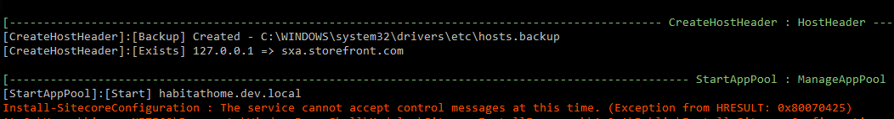

# Automate installing Sitecore Commerce 9 update 2 (Sitecore.Commerce.2018.07-2.2.126)

## Prerequisites

- A blank instance of Sitecore 9 update 2 must be installed with the following information
  - **Site domain**: `sc92commerce.dev.local`
  - **xConnectRoot**: `sc92commerce_xconnect.dev.local`
- Download and install [Dotnet core 2.0 SDK](https://www.microsoft.com/net/download/thank-you/dotnet-sdk-2.1.202-windows-x64-installer)
  - Current version: `2.0.9`
  - Current SDK version: `2.1.202`
- Download and install [DotNetCore.2.0.0-WindowsHosting](https://download.microsoft.com/download/B/1/D/B1D7D5BF-3920-47AA-94BD-7A6E48822F18/DotNetCore.2.0.0-WindowsHosting.exe)
- Download `Sitecore.Commerce.2018.07-2.2.126.zip` from [Sitecore Experience Commerce 9.0 Update-2](https://dev.sitecore.net/Downloads/Sitecore_Commerce/90/Sitecore_Experience_Commerce_90_Update2.aspx)
- Download `Sitecore PowerShell Extensions-4.7.2 for Sitecore 8.zip` package
- Download `Sitecore Experience Accelerator 1.7.1 rev. 180604 for 9.0.zip` package from [Sitecore Experience Accelerator 1.7 Update-1 (Sitecore Experience Accelerator for 9.0)](https://dev.sitecore.net/Downloads/Sitecore_Experience_Accelerator/17/Sitecore_Experience_Accelerator_17_Update1.aspx)

## Getting started

### Before installing

- The following is a list of default values / assumptions for install locations
  - **Project location**: `F:\github\sitecore\sitecore-9-commerce-installation`
  - **Web Root**: `D:\Inetpub\wwwroot`
  - **Solr Root Folder**: `D:\_SolrData`
- Restart IIS
- Re-build link database
- Re-build search indexes
- Register the account on **Braintree**, then get the below information
  - MerchantId
  - PublicKey
  - PrivateKey
- Clone the repository to local to **Project location**
- Copy the following `*.zip` files to `assets` folder
    1. `Sitecore.Commerce.2018.07-2.2.126.zip`
    2. `Sitecore PowerShell Extensions-4.7.2 for Sitecore 8.zip`
    3. `Sitecore Experience Accelerator 1.7.1 rev. 180604 for 9.0.zip`
- Open the `paramerters.ps1` file by any editor then modify the corresponding values

  ```powershell
  $scinstance = "sc92commerce"
  $scwebroot = "E:\Inetpub\wwwroot"
  $solrUrl = "https://localhost:8983/solr"
  $solrRootFolder = "E:\\Docker\\SolrData"
  $HostNamePostFix = "dev.local"

  $SqlServer = $($Env:COMPUTERNAME) #OR "SQLServerName\SQLInstanceName"
  $SqlAdminUser = "sa"
  $SqlAdminPassword = '--------SqlAdminPassword--------------'

  $BraintreeAccount = @{
    MerchantId = '-------------Merchant ID-------------------'
    PublicKey = '-------------Public Key-------------------'
    PrivateKey = '-------------Private Key-------------------'
  }

  $ServicesPortSuffix = "0" # Support for multiple instances
  ```

### Installing

- Open the **PowerShell** as _**administrator**_; then execute `install.ps1`
- Waiting to finish
- _**(Optional)**_ It might be needed to start **SQL Server** service manually

## Uninstall

- Open the **PowerShell** as _**administrator**_; then execute `uninstall.ps1`

## Resources

1. [Install Sitecore 9 instance](https://kimcu.wordpress.com/2018/07/16/all-in-one-sitecore-9-0-multiple-versions-solr-with-ssl-through-docker/)
2. [Sitecore Commerce 9 Update 2 and Step-by-step Install Guide on your machine](https://buoctrenmay.com/2018/07/15/sitecore-commerce-9-update-2-and-step-by-step-install-guide-on-your-machine/)

## Known Issues

### 1. Errors on importing DacPac file

- Download & Install the following packages from SQLServer 2016 Feature Pack
  - [SqlDom.msi](https://download.microsoft.com/download/B/1/7/B1783FE9-717B-4F78-A39A-A2E27E3D679D/ENU/x64/SqlDom.msi)
  - [SQLSysClrTypes.msi](https://download.microsoft.com/download/B/1/7/B1783FE9-717B-4F78-A39A-A2E27E3D679D/ENU/x64/SQLSysClrTypes.msi)
- Download and Install [Data-Tier Application Framework (June 30 2016)](https://www.microsoft.com/en-us/download/details.aspx?id=53013)

### 2. Install-SitecoreConfiguration : The service cannot accept control messages at this time. (Exception from HRESULT: 0x80070425)



- Open the **IIS Manager** and start the site manually